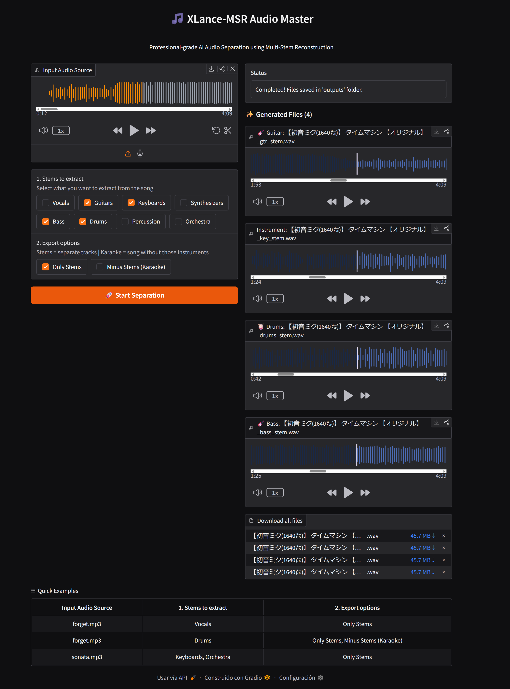

# 🎵 XLance-MSR Pro

**XLance-MSR Pro** is a professional-grade AI Audio Separation tool powered by Multi-Stem Reconstruction (MSR). Designed for high-fidelity extraction of musical components, it provides state-of-the-art results for producers, musicians, and audio enthusiasts.



> [!IMPORTANT]
> **Heavy Processing**: This application uses advanced AI models. Separation is a resource-intensive process and may take **several minutes** to complete per track. Please be patient while the system processes your audio.

---

## ✨ Key Features

- 🎹 **Multi-Instrument Separation**: Extract Vocals, Drums, Bass, Guitars, Keyboards, Synths, and more.
- 🎤 **Karaoke / Backing Track Mode**: Generate a perfect mix by removing specific instruments from the original track.
- 🌊 **Real-time Waveform Visualization**: Interactive audio players with synchronized waveforms for every generated file.
- 🚀 **One-Click Installation**: Managed by `uv` for lightning-fast setup and dependency management.
- 📂 **Clean Output Management**: Automatically organizes results in a dedicated `outputs/` folder with clear labeling.

---

## 🖥️ User Interface

The application features a sleek, professional Gradio interface designed for ease of use:

1. **Audio Input**: Drag & Drop or Upload any audio file (MP3, WAV, FLAC).
2. **Stem Selection**: Choose exactly which instruments you want to process.
3. **Export Options**: 
   - `Only Stems`: Export individual tracks for each instrument.
   - `Minus Stems (Karaoke)`: Export a single track containing everything *except* your selection.
4. **Interactive Results**: Listen to and download your files directly from the browser with beautiful waveform previews.

---

## ⚙️ System Requirements

This system is built for extreme performance and requires professional-grade hardware:

- **OS**: Windows 10 or 11.
- **GPU**: NVIDIA GPU with **24 GB+ VRAM** (e.g., RTX 3090, RTX 4090, RTX 5090, or professional A-series).
- **Disk**: ~10GB for models and dependencies.

---

## 🛠️ Installation & Setup

Setting up XLance-MSR Pro is easier than ever thanks to the automated `uv` environment.

### 1. Clone the Repository
```bash
git clone https://github.com/your-repo/xlance-msr.git
cd xlance-msr
```

### 2. Install Dependencies
Simply double-click:
- **`install.bat`** 🛠️

*This script will:*
- Install the `uv` package manager (if missing).
- Create a dedicated virtual environment.
- Install PyTorch with **CUDA/GPU** support.
- Sync all required professional audio libraries.

---

## 🚀 How to Run

Once installed, launching the app is simple:

Double-click:
- **`start.bat`** ⚡

*This will:*
- Launch the Gradio web server.
- Open the GUI in your default browser (usually at `http://127.0.0.1:7860`).